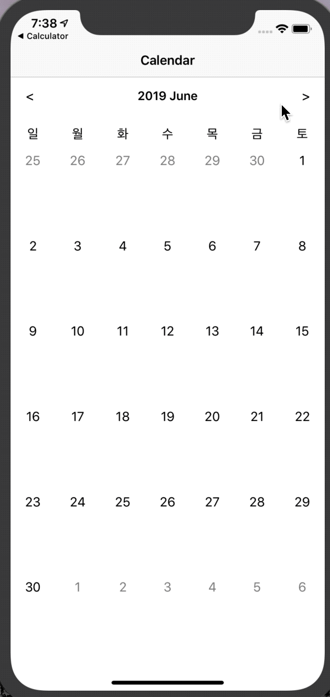

# Calendar
Simpel Calendar, I referred to [this tutorial](https://www.youtube.com/watch?v=srJj8U5d5ok)

### Screenshot

## 배운내용
- Calendar
  - get Calendar info
  - calculate date

## TODO
- [ ] add schedule
- [ ] create flexible screen when raise
