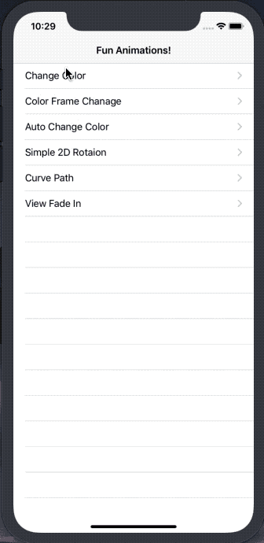

# Animations
Fun Animations!!  
I was reference [soapyigu's Swift-30-Project](https://github.com/soapyigu/Swift-30-Projects/tree/master/Project%2011%20-%20Animations)

### Screenshot


## 배운내용

- Animation
- CGAffineTransform
- UIBezierPathå

### Animation

colorSet 추가로 색이 계속 변화되게 업그레이드

기본 `UIView.animate` 사용 
```swift
UIView.animate(withDuration: TimeInterval, animations: () -> Void, completion: ((Bool) -> Void)?)
```
### CGAffineTransform

2D 그래픽을 그리기 위한 Affine 변환 메트릭스를 뜻한다.

affine transformation matrix는 object를 회전, 축적, 변환하고 그리는데 사용된다. 깊게 들어가면 벌써부터 머리가 아프지만.. 다행히 친절히 애플에서 제공해주기 때문에 우리는 쉽게 사용할 수 있다. 
```swift
/// when table reload
// 
// move all cells to the bottom of the screen
for cell in cells {
    cell.transform = CGAffineTransform(translationX: 0, y: tableHeight)
}

// move all cells from bottom to the right place
for cell in cells {
    UIView.animate(withDuration: duration, delay: 0.05 * Double(index), usingSpringWithDamping: 0.8, initialSpringVelocity: 0, options: [], animations: {
        cell.transform = CGAffineTransform(translationX: 0, y: 0)
    }, completion: nil)
    index += 1
}

/// when rotation
UIView.animate(withDuration: self.duration, delay: self.delay, options: [.repeat], animations: {
    self.animateView.transform = CGAffineTransform(rotationAngle: CGFloat(angel))
}, completion: nil)
```
### UIBezierPath

직선이나 곡선을 원하는대로 렌더링하기 위해 사용한다. 경로를 다시 그리는 느낌으로 생각하면 될듯하다.

UIBezierPath로 길을 만들고 `CAKeyframeAnimation` 을 사용해 animation을 만들어 layer에 붙여서 curve를 구현한다.
  ```swift
    fileprivate func curvePath(_ endPoint: CGPoint, controlPoint1: CGPoint, controlPoint2: CGPoint) {
        let path = UIBezierPath()
        path.move(to: self.animateView.center)
        path.addCurve(to: endPoint, controlPoint1: controlPoint1, controlPoint2: controlPoint2)
        
        // create a new CAKeyframeAnimation that animates the objects position
        let anim = CAKeyframeAnimation(keyPath: "position")
        
        // set the animations path to our bezier curve
        anim.path = path.cgPath
        
        // set some more parameters for the animation
        anim.duration = self.duration
        
        // add the animation to the squares 'layer' property
        self.animateView.layer.add(anim, forKey: "animate position along path")
        self.animateView.center = endPoint
    }
  ```
